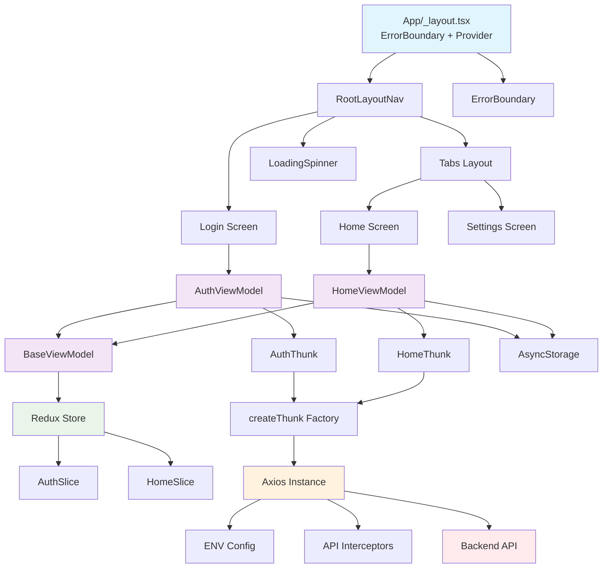

# Mobile App - MVVM + Redux Architecture

## 📱 Tổng quan

Ứng dụng mobile được xây dựng với **MVVM (Model-View-ViewModel)** pattern kết hợp **Redux Toolkit** để tạo ra một cấu trúc code sạch, dễ bảo trì và testable. Đã được cải tiến với error handling, loading states, và type safety hoàn chỉnh.

## 🏗️ Kiến trúc

### Architecture Diagram



## 🔧 Các cải tiến đã thực hiện

### ✅ **Bug Fixes**
- **BaseViewModel state access**: Sửa `getState(dispatch)` thành `getCurrentState()` function
- **BaseViewModel executeAsync**: Thêm type-safe actions thay vì generic dispatch
- **AuthSlice error handling**: Đọc `action.payload` trước khi fallback
- **Authentication flow**: Tự động set `isAuthenticated` khi có token
- **Typo fix**: `signIWithGoogle` → `signInWithGoogle`

### 🚀 **Performance & TypeScript**
- **Optimized useViewModel**: Sử dụng `useMemo` để tránh re-creation
- **Improved TypeScript**: Type-safe dispatch và selectors
- **Complete interfaces**: Thêm signup models và response types

### 🎨 **UX Improvements**
- **LoadingSpinner**: Component loading chung với customizable props
- **ErrorBoundary**: Xử lý lỗi React với fallback UI
- **Loading states**: Hiển thị loading khi check auth

### ⚙️ **Configuration**
- **ENV config**: Centralized environment variables
- **Axios improvements**: Better interceptors, logging, storage management
- **Storage management**: Centralized storage keys

## 📁 Cấu trúc thư mục

```
📦 moblie/
├── 📁 app/                          # 🎨 View Layer
│   ├── 📄 _layout.tsx              # Root layout với navigation
│   ├── 📄 login.tsx                # Login screen
│   ├── 📄 modal.tsx                # Modal screen
│   └── 📁 (tabs)/                  # Tab navigation
│       ├── 📄 _layout.tsx          # Tab layout
│       ├── 📄 index.tsx            # Home screen
│       └── 📄 two.tsx              # Settings screen
│
├── 📁 viewmodels/                   # 🧠 ViewModel Layer
│   ├── 📁 shared/
│   │   └── 📄 BaseViewModel.ts     # Base ViewModel class
│   ├── 📁 auth/
│   │   └── 📄 AuthViewModel.ts     # Auth business logic
│   ├── 📁 home/
│   │   └── 📄 HomeViewModel.ts     # Home business logic
│   └── 📄 index.ts                 # Exports
│
├── 📁 features/                     # 🔄 Redux Layer
│   ├── 📁 auth/
│   │   ├── 📄 authSlice.ts         # Auth state + actions
│   │   └── 📄 authThunk.ts         # Async actions
│   └── 📁 home/
│       └── 📄 homeSlice.ts         # Home state + actions
│
├── 📁 models/                       # 📊 Model Layer
│   ├── 📁 auth/
│   │   ├── 📄 signin.ts            # SignIn interfaces
│   │   └── 📄 signup.ts            # SignUp interfaces
│   ├── 📁 generic/
│   │   ├── 📄 baseState.ts         # Base state interface
│   │   ├── 📄 genericResponse.ts   # Generic response
│   │   └── 📄 thunkOptions.ts      # Thunk options
│   └── 📁 enum/
│       └── 📄 httpMethod.ts        # HTTP methods enum
│
├── 📁 lib/                          # 🔧 Infrastructure
│   ├── 📁 redux/
│   │   ├── 📄 store.ts             # Redux store
│   │   └── 📄 hooks.ts             # Typed hooks
│   ├── 📁 axios/
│   │   └── 📄 axiosInstance.ts     # HTTP client
│   └── 📁 jwt/                     # JWT utilities
│
├── 📁 components/                   # 🧩 Shared Components
│   ├── 📄 Themed.tsx               # Themed components
│   ├── 📄 EditScreenInfo.tsx       # Reusable components
│   ├── 📄 LoadingSpinner.tsx       # Loading component
│   ├── 📄 ErrorBoundary.tsx        # Error boundary component
│   └── 📄 useColorScheme.ts        # Color scheme hook
│
├── 📁 constants/                    # 📋 Constants
│   └── 📄 Colors.ts                # Color definitions
│
├── 📁 config/                       # ⚙️ Configuration
│   └── 📄 env.ts                   # Environment variables
│
└── 📄 package.json                  # Dependencies
```

## 🔄 Data Flow

```
User Action (Login) → AuthViewModel.login() → dispatch(signIn()) → 
API Call → AsyncStorage → Redux State Update → UI Re-render
```

### Authentication Flow
1. **User Input**: Email/password trong Login screen
2. **ViewModel**: AuthViewModel xử lý validation
3. **Thunk**: signIn thunk gọi API
4. **Storage**: Lưu token vào AsyncStorage
5. **State**: Update Redux state
6. **Navigation**: Redirect đến Home screen

## ✨ Tính năng chính

- 🔐 **Authentication**: Login/logout với token management
- 🏠 **Home Dashboard**: User info và welcome message
- 🔄 **State Management**: Redux Toolkit với DevTools
- 📱 **Navigation**: Expo Router với stack và tab navigation
- 🎨 **Theming**: Light/Dark mode support
- 🔧 **Type Safety**: TypeScript support đầy đủ
- 🧪 **Testable**: MVVM pattern dễ test
- ⚡ **Error Handling**: ErrorBoundary và graceful error handling
- 🔄 **Loading States**: Proper loading indicators
- 🛡️ **Security**: Secure token management với auto-cleanup

## 🛠️ Công nghệ sử dụng

- **React Native** - Mobile framework
- **Expo** - Development platform
- **TypeScript** - Type safety với strict mode
- **Redux Toolkit** - State management
- **Expo Router** - Navigation
- **Axios** - HTTP client với interceptors
- **AsyncStorage** - Local storage

### Dependencies chính

```json
{
  "expo": "~53.0.20",
  "react": "19.0.0",
  "react-native": "0.79.5",
  "@reduxjs/toolkit": "^2.8.2",
  "expo-router": "~5.1.4",
  "axios": "^1.11.0",
  "@react-native-async-storage/async-storage": "^1.23.1"
}
```

## 🎯 Cách sử dụng

### 1. Cài đặt dependencies

```bash
npm install
# hoặc
yarn install
```

### 2. Cấu hình environment

Tạo file `.env` hoặc cấu hình `EXPO_PUBLIC_API_URL`:

```env
EXPO_PUBLIC_API_URL=https://your-api-url.com/api
```

### 3. Chạy ứng dụng

```bash
# Development
npm start

# iOS
npm run ios

# Android
npm run android

# Web
npm run web
```

## 🧪 Testing

```bash
# Chạy tests
npm test

# Test coverage
npm run test:coverage
```

## 🏗️ Architecture Patterns

### MVVM Flow

```
View (React Components) 
  ↓ User Actions
ViewModel (Business Logic)
  ↓ Dispatch Actions  
Redux Store (State Management)
  ↓ API Calls
Model (Data Layer)
```

### Key Principles

- **Separation of Concerns**: Mỗi layer có trách nhiệm riêng
- **Unidirectional Data Flow**: Redux pattern
- **Type Safety**: Full TypeScript coverage
- **Error Boundaries**: Graceful error handling
- **Loading States**: Proper UX feedback

## 📚 Tài liệu tham khảo

- [MVVM Pattern](https://en.wikipedia.org/wiki/Model%E2%80%93view%E2%80%93viewmodel)
- [Redux Toolkit](https://redux-toolkit.js.org/)
- [Expo Router](https://docs.expo.dev/router/introduction/)
- [React Native](https://reactnative.dev/)

## 🤝 Đóng góp

1. Fork repository
2. Tạo feature branch (`git checkout -b feature/amazing-feature`)
3. Commit changes (`git commit -m 'Add amazing feature'`)
4. Push to branch (`git push origin feature/amazing-feature`)
5. Tạo Pull Request

## 📄 License

MIT License - xem file [LICENSE](LICENSE) để biết thêm chi tiết.